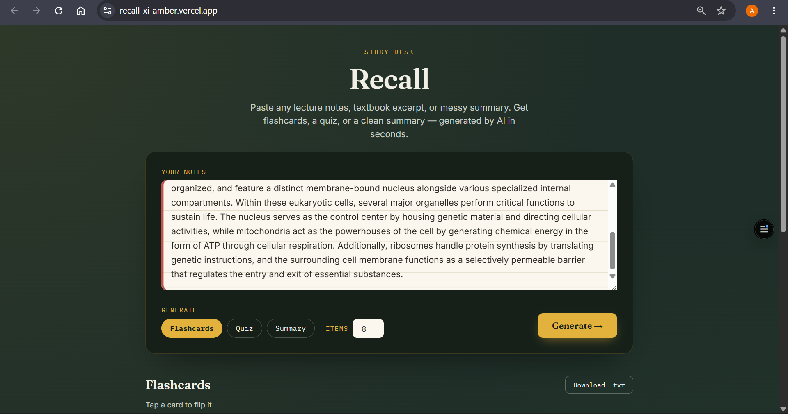
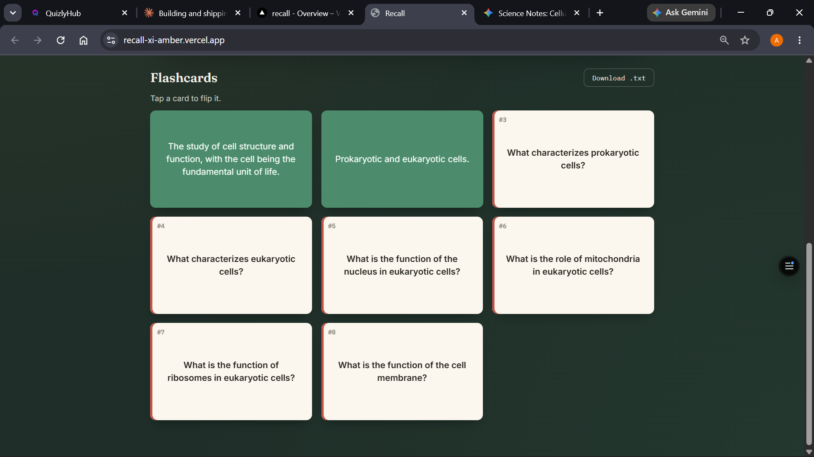
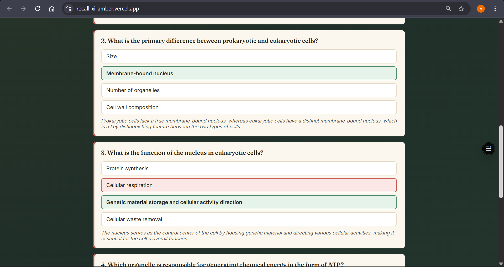
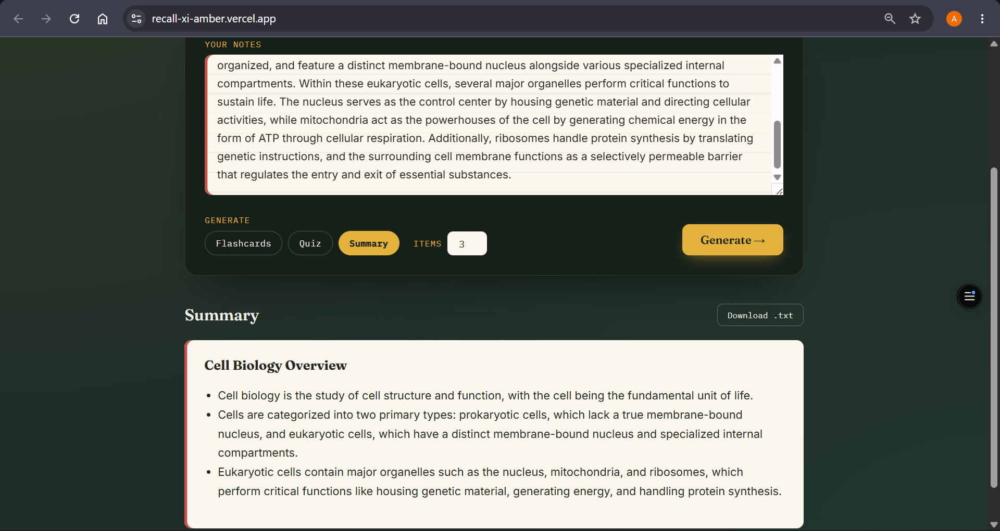

# Recall

**Turn messy study notes into flashcards, a quiz, or a summary in seconds.**

## a. What it does & the problem it solves

Students spend a huge amount of time doing something that isn't actually studying: reformatting their own notes into flashcards or quiz questions before an exam. Recall removes that step entirely. Paste in raw, messy lecture notes or a textbook excerpt, pick a format, and get back study-ready material instantly.

**Who it's for:** students (school, university, or self-taught learners) who have notes but no time to turn them into something they can actually drill themselves on — especially useful the night before an exam.

This isn't a notes app or a generic "chat with your PDF" clone — it's a single-purpose tool built around one real, specific workflow: *notes in → drillable study material out*, in three interchangeable formats.

## b. Live URL

🔗 **[https://recall.vercel.app](https://recall-xi-amber.vercel.app/))** 

## c. Features

- **Paste any notes** — plain text, no formatting required.
- **Three AI-generated output modes:**
  - **Flashcards** — flip-able front/back cards (click to flip).
  - **Quiz** — multiple-choice questions with instant right/wrong feedback, an explanation per question, and a running score.
  - **Summary** — a clean, titled bullet-point recap of the key ideas.
- **Adjustable item count** (3–20 items per generation).
- **Download results** as a `.txt` file to keep or print.
- **Local history** — your last 10 generations are saved in your browser (localStorage) so you don't lose earlier results.
- Fully responsive, works on mobile and desktop.
- Friendly error handling for empty input, API failures, or malformed AI responses.

## d. The AI feature

**What it does:** The core of Recall is a single AI call that reads the user's raw notes and converts them into one of three strict JSON structures (flashcards / quiz / summary), which the frontend then renders as an interactive UI. The AI is instructed to extract only genuinely important content, match the difficulty of the source material, and never fabricate facts that aren't in the notes.

**Model used:** Groq (running Llama 3.3 70B), called server-side from a Vercel serverless function so the API key is never exposed to the browser. Groq was chosen because it offers a genuinely free, no-billing-required API tier with fast inference and generous rate limits, which keeps this project free to run and grade.

**The exact system prompt used** (see `api/generate.js`):

```
You are Recall, an expert study assistant used inside a web app.
Your ONLY job is to read a student's raw notes and convert them into study material.

Rules you must always follow:
1. Read the notes carefully and extract the genuinely important concepts, facts,
   definitions, and relationships. Ignore filler, headers, and formatting noise.
2. Never invent facts that are not supported by the notes. If the notes are thin,
   produce fewer, higher-quality items rather than padding with invented content.
3. Match the difficulty and terminology to the notes themselves (don't oversimplify
   technical material, don't overcomplicate simple material).
4. You must respond with ONLY valid JSON. No markdown code fences, no commentary,
   no preamble, no trailing text. The response must be parseable by JSON.parse()
   as-is.
5. Produce exactly the JSON shape requested for the given mode below, and produce
   as close to {N} items as the notes reasonably support (fewer is fine if the
   notes are short; never fabricate to hit the count).

JSON shapes by mode:

mode = "flashcards":
{ "flashcards": [ { "front": "...", "back": "..." }, ... ] }

mode = "quiz":
{ "quiz": [ { "question": "...", "options": ["A","B","C","D"],
             "correctIndex": 0, "explanation": "..." }, ... ] }

mode = "summary":
{ "summary": { "title": "...", "bullets": ["...", ...] } }

Return JSON for mode = "{mode}" only.
```

The user's notes and chosen mode/count are sent as the human turn; the response is parsed as JSON and rendered directly into the flashcard/quiz/summary UI.

## e. Tools, services, and AI models used

- **Frontend:** Plain HTML, CSS, and vanilla JavaScript (no framework needed — keeps it lightweight and fast).
- **Backend:** A single Vercel Serverless Function (`api/generate.js`, Node.js runtime).
- **AI model:** Groq (llama-3.3-70b-versatile), via Groq's OpenAI-compatible Chat Completions API
- **Hosting/deployment:** Vercel (free tier).
- **Version control:** GitHub 
- **Design:** Custom "study desk" visual theme (hand-built CSS, Google Fonts: Fraunces + Inter + IBM Plex Mono) 

## f. Screenshots

**1. Paste your notes**


**2. Flashcards — click to flip**


**3. Quiz — instant feedback + score**


**4. Summary view**


## g. How to run the project

### Run it locally

1. Clone the repo:
   ```bash
   git clone https://github.com/YOUR_USERNAME/recall.git
   cd recall
   ```
2. Install the Vercel CLI (used for local dev with serverless functions):
   ```bash
   npm install -g vercel
   ```
3. Copy `.env` and add your own free Groq API key (get one at console.groq.com/keys)
   
5. Run the dev server:
   ```bash
   vercel dev
   ```
6. Open the printed local URL (usually `http://localhost:3000`) in your browser.


